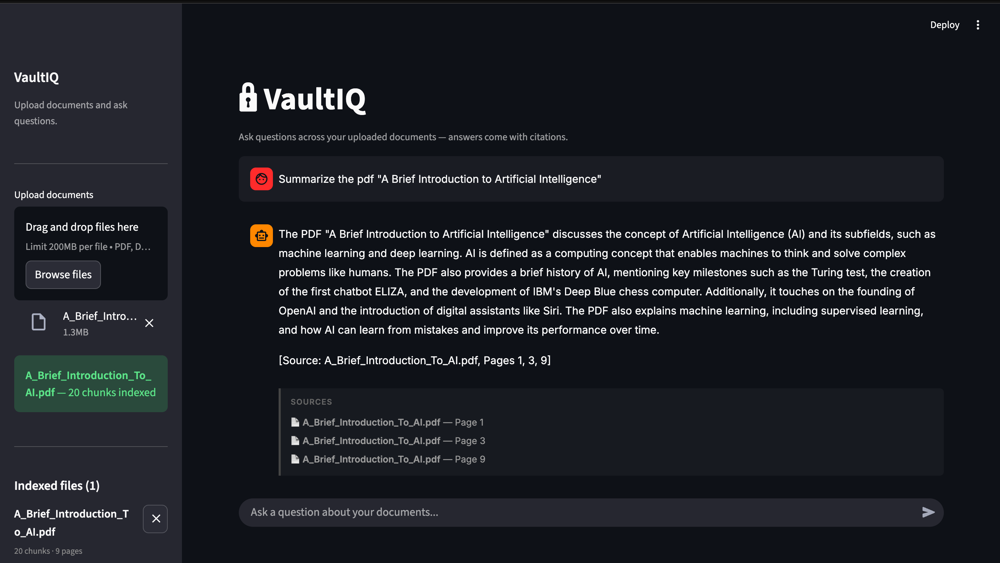

# VaultIQ

A RAG-powered document Q&A app. Upload PDFs, DOCX, or TXT files and ask questions in plain English — answers come with citations showing exactly which document and page the information came from.

No OpenAI key needed. The whole stack is free: embeddings run locally via `sentence-transformers`, and the LLM is served through [Groq's free API](https://console.groq.com).



---

## How it works

1. You upload a document
2. It gets chunked (500 tokens, 50 overlap) and embedded with `all-MiniLM-L6-v2`
3. Embeddings are stored in a local ChromaDB instance
4. When you ask a question, the top 5 most relevant chunks are retrieved via cosine similarity
5. Those chunks are passed to `llama3-8b-8192` on Groq, which generates an answer with citations

---

## Setup

**1. Clone the repo and install dependencies**

```bash
git clone https://github.com/yourusername/vaultiq.git
cd vaultiq
python -m venv venv
source venv/bin/activate  # Windows: venv\Scripts\activate
pip install -r requirements.txt
```

**2. Set up your environment**

```bash
cp .env.example .env
```

Open `.env` and add your Groq API key. You can get one for free at [console.groq.com](https://console.groq.com) — no credit card required.

**3. Start the backend**

```bash
uvicorn app.main:app --reload
```

**4. Start the frontend** (in a separate terminal)

```bash
streamlit run frontend/streamlit_app.py
```

Then open [http://localhost:8501](http://localhost:8501) in your browser.

---

## API endpoints

| Method | Endpoint | Description |
|--------|----------|-------------|
| `POST` | `/upload` | Upload and index a document |
| `POST` | `/ask` | Ask a question, get an answer + sources |
| `GET` | `/documents` | List all indexed documents |
| `DELETE` | `/documents/{filename}` | Remove a document |

---

## Project structure

```
vaultiq/
├── app/
│   ├── main.py          # FastAPI app
│   ├── ingest.py        # Parsing, chunking, embedding
│   ├── retriever.py     # ChromaDB similarity search
│   ├── llm.py           # Groq API integration
│   └── config.py        # Settings and env vars
├── frontend/
│   └── streamlit_app.py # UI
├── uploads/             # Uploaded files (gitignored)
├── chroma_db/           # Vector store (gitignored)
├── requirements.txt
└── .env.example
```

---

## Tech stack

- **Backend**: FastAPI + Python 3.11
- **Embeddings**: `sentence-transformers` (all-MiniLM-L6-v2) — runs locally
- **Vector store**: ChromaDB (persistent, local)
- **LLM**: Groq API — `llama3-8b-8192`
- **Document parsing**: PyMuPDF, python-docx
- **Frontend**: Streamlit
